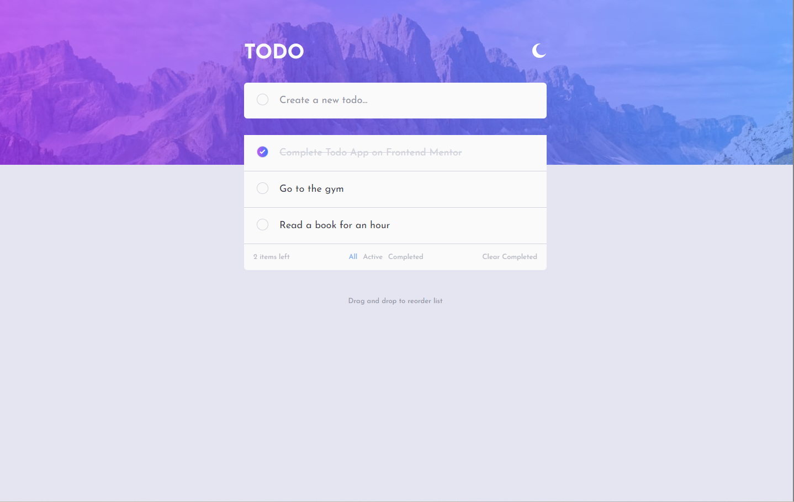
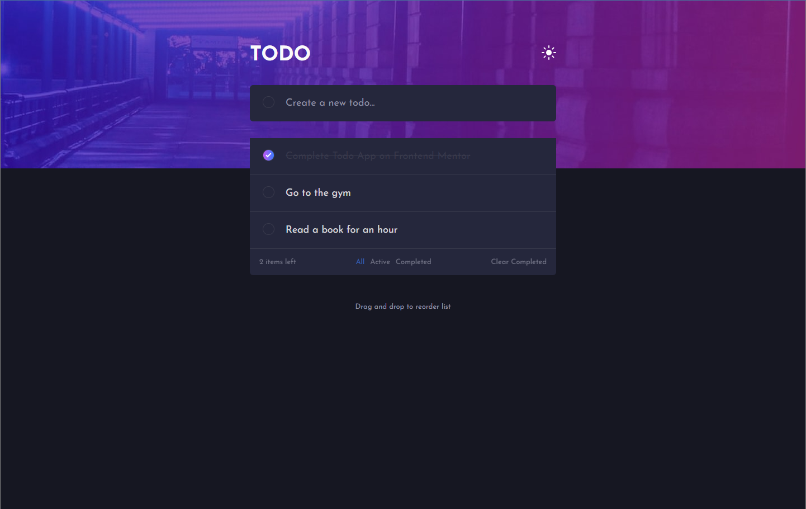
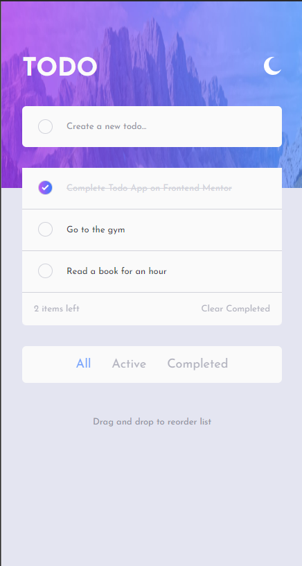
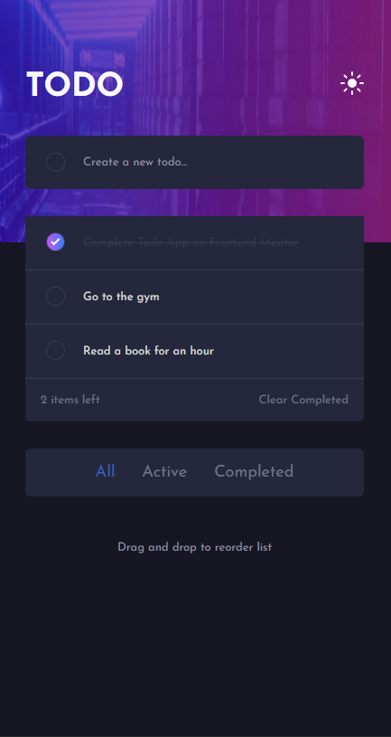

# Frontend Mentor - Todo app solution

This is a solution to the [Todo app challenge on Frontend Mentor](https://www.frontendmentor.io/challenges/todo-app-Su1_KokOW). Frontend Mentor challenges help you improve your coding skills by building realistic projects.

## Table of contents

- [Overview](#overview)
  - [The challenge](#the-challenge)
  - [Screenshots](#screenshots)
- [Tech Stack](#tech-stack)
- [Author](#author)

## Overview

### The challenge

Users should be able to:

- View the optimal layout for the app depending on their device's screen size
- See hover states for all interactive elements on the page
- Add new todos to the list
- Mark todos as complete
- Delete todos from the list
- Filter by all/active/complete todos
- Clear all completed todos
- Toggle light and dark mode
- Bonus: Drag and drop to reorder items on the list

### Screenshots

| Light Theme                                  | Dark Theme                                 |
| -------------------------------------------- | ------------------------------------------ |
|  |  |
|    |    |

## Tech Stack

- [React](https://reactjs.org/)
- [dnd kit](https://dndkit.com/) - For drag & drop
- [Sass](https://sass-lang.com/) - For styles

## Author

- Frontend Mentor - [@Dogukanays](https://www.frontendmentor.io/profile/Dogukanays)
- Linkedin - [@dogukan-aysan](https://www.linkedin.com/in/dogukan-aysan/)
- Email - <dogukanaysan01@gmail.com>
